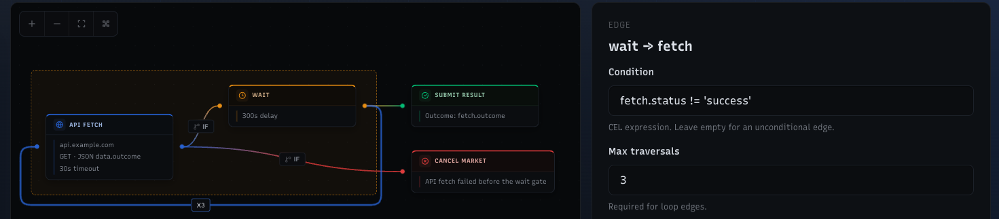
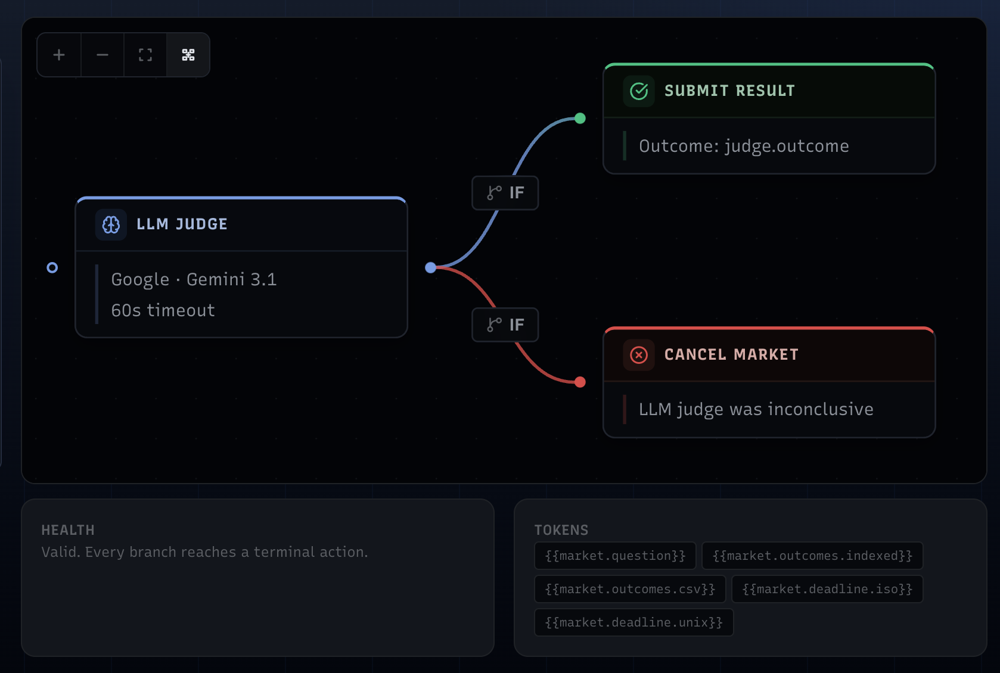
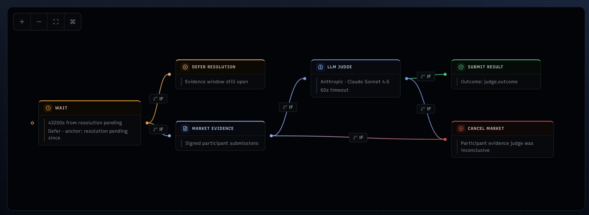

# resolution-engine

Async blueprint execution service for [question.market](https://question.market).

Scoped to execution only:

- accepts blueprint execution requests over HTTP
- runs DAG-based resolution logic
- exposes async run status and cancellation
- emits structured execution traces for observability

It does not poll markets, decide lifecycle transitions, submit on-chain transactions, or own durable orchestration state. Those concerns belong to the indexer/orchestrator.

## Quick start

Requires Go 1.23+.

```bash
go mod download

# Required
export INDEXER_URL=http://localhost:3001
export LISTEN_PORT=3002

# LLM providers (at least one recommended)
export ANTHROPIC_API_KEY=...
export OPENAI_API_KEY=...
export GOOGLE_API_KEY=...

# Optional auth
export ENGINE_CONTROL_TOKEN=...
export ENGINE_CALLBACK_TOKEN=...
export TRACE_INGEST_TOKEN=...

go run .
```

## HTTP API

### POST /run

Submit a blueprint execution request.

```json
{
  "app_id": 123,
  "blueprint_json": {"id": "bp", "nodes": [], "edges": []},
  "inputs": {"market_question": "Will BTC hit 150k?"},
  "blueprint_path": "main",
  "initiator": "indexer:status-transition",
  "callback_url": "http://indexer.local/markets/123/resolution-result"
}
```

Returns `202 Accepted` with a `run_id`. Returns `409 Conflict` if the market already has an active run.

Invalid blueprints are rejected with `400 Bad Request` and a list of validation issues.

### GET /runs/{run_id}

Returns run state while the engine retains the run (bounded TTL).

### DELETE /runs/{run_id}

Cancels an in-flight run.

### GET /health

Returns service health and active run count.

## Architecture

The engine executes resolution blueprints as DAGs with conditional branching (CEL expressions). Each node runs a typed executor:


| Executor              | Description                                                      |
| --------------------- | ---------------------------------------------------------------- |
| `llm_judge`           | Multi-provider LLM evaluation (Anthropic, OpenAI, Google)        |
| `api_fetch`           | External data source fetching                                    |
| `market_evidence`     | On-chain market state and trade history                          |
| `human_judge`         | Delegates to a human arbiter (configurable `allowed_responders`) |
| `outcome_terminality` | Checks if an outcome is terminal                                 |
| `defer_resolution`    | Defers resolution to a later time                                |
| `wait`                | Pauses execution for a duration                                  |
| `submit_result`       | Marks the final outcome                                          |
| `cancel_market`       | Marks the market for cancellation                                |


Terminal results carry an action: `propose`, `finalize_dispute`, `cancel_market`, `defer`, or `none`.

## Blueprint semantics

A blueprint is a directed graph of steps. Each step writes values into a shared execution context, and later steps or edges can read those values.

### Inputs and context

The engine seeds your request inputs into the context twice:

- as plain keys like `market_question`
- as `input.*` keys like `input.market_question`

That means either style can be referenced by executors and conditions.

```text
POST /run
  inputs = {
    "market_question": "Will BTC hit 150k?",
    "main_outcome": "0"
  }

Context at start:
  market_question        = "Will BTC hit 150k?"
  input.market_question  = "Will BTC hit 150k?"
  main_outcome           = "0"
  input.main_outcome     = "0"
```

A node can then emit outputs like:

- `fetch.status = success`
- `fetch.outcome = 1`
- `judge.reason = ...`

### Conditional edges (CEL)

Edges can have conditions written in [CEL (Common Expression Language)](https://cel.dev). A target node only becomes reachable if the edge condition evaluates to true. See the [CEL language spec](https://github.com/google/cel-spec/blob/master/doc/langdef.md) for the full reference.

Context values are available as CEL variables using the dotted key convention (`nodeId.field`). Scalar values from executor outputs are strings. JSON arrays and objects stored in context (such as `_runs` history) are passed to CEL as native lists and maps, so standard operators work on them:

```cel
fetch.status == 'success'
fetch.status != 'success'
judge.outcome != 'inconclusive' && judge.outcome != ''
wait.status == 'success'

// List operations on node history (see below)
fetch._runs.size() > 0
fetch._runs.exists(r, r.status == 'success')

// Map field access on structured values
judge.details.confidence > 0.5
```

Typical pattern:
- success path goes to `submit_result`
- failure or inconclusive path goes somewhere else (`cancel_market`, `defer_resolution`, another judge, etc.)

### Node history (`_runs`)

When a node is re-executed via a back-edge loop, the engine snapshots its outputs before resetting. These snapshots accumulate in `nodeId._runs` as a JSON array, giving downstream nodes and edge conditions forensic access to all prior executions.

`nodeId.field` always holds the latest value (last-write-wins). `nodeId._runs` holds the history of all previous iterations (not including the current one).

Example: a node `fetch` is looped 3 times. After the run completes:
- `fetch.status` = output from iteration 3 (latest)
- `fetch._runs` = `[{iteration 1 outputs}, {iteration 2 outputs}]`

### Back edges and bounded loops

Blueprints can loop by using a back edge. Back edges must be bounded with `max_traversals`, otherwise they are treated as exhausted.

This gives you patterns like:
- fetch
- wait
- retry fetch up to N times
- then continue or fail

Loop example from the UI:



The engine records edge traversal counts, so loops are explicit and inspectable.

### A small example

Here is a simpler workflow from the UI:



A common pattern is:
- gather some evidence or judgment input
- if the result is usable, flow into `submit_result`
- if the result is not usable, flow into `cancel_market`

In practice:

- nodes read inputs and context
- nodes write outputs back into context
- edges decide where execution goes next
- back edges allow bounded retry loops
- `submit_result` and `cancel_market` are the primary terminal actions

### A more complex example

Below is a more complex blueprint from the visual editor. It combines a timing gate, participant evidence collection, an LLM-based judgment, and multiple terminal branches.



Execution flow:

- `Evidence Window` is a `wait` node configured with:
  - `duration_seconds: 43200`
  - `mode: 'defer'`
  - `start_from: 'resolution_pending_since'`
- while the evidence window is still open:
  - `wait.status == 'waiting'` sends execution to `Retry Later`
  - `wait.status == 'success'` is not yet true, so the graph does not proceed to `Participant Evidence`
  - rerunning before the waiting period expires produces the same defer outcome rather than advancing deeper into the graph
- once `wait.status == 'success'`, the workflow proceeds to `Participant Evidence`
- `Participant Evidence` loads submitted evidence bundles for adjudication rather than relying only on passive market metadata
- if that evidence bundle is successfully assembled, the workflow proceeds to `LLM Judge`
- the `LLM Judge` either:
  - emits a concrete outcome -> `Submit Result`
  - emits an empty or inconclusive result -> `Cancel Market`
- if evidence collection itself fails to produce a usable bundle, the workflow can also go directly to `Cancel Market`

Every branch still ends in a terminal action:

- `defer_resolution`
- `submit_result`
- `cancel_market`

Operationally, each run ends by either deferring, proposing a result, or explicitly cancelling.

<details>
<summary>Show the blueprint JSON for this UI example</summary>

```json
{
  "id": "participant-evidence-llm",
  "name": "Participant Evidence + LLM",
  "description": "Wait for the evidence window to close, load participant submissions, then judge with an LLM.",
  "nodes": [
    {
      "id": "wait",
      "type": "wait",
      "label": "Evidence Window",
      "config": {
        "duration_seconds": 43200,
        "mode": "defer",
        "start_from": "resolution_pending_since"
      }
    },
    {
      "id": "defer",
      "type": "defer_resolution",
      "label": "Retry Later",
      "config": {
        "reason": "Evidence window still open"
      }
    },
    {
      "id": "evidence",
      "type": "market_evidence",
      "label": "Participant Evidence",
      "config": {}
    },
    {
      "id": "judge",
      "type": "llm_judge",
      "label": "LLM Judge",
      "config": {
        "prompt": "Question: {{market.question}}\nOutcomes: {{market.outcomes.indexed}}\nParticipant evidence count: {{evidence.count}}\nClaimed outcome summary: {{evidence.claimed_summary}}\n\nParticipant evidence entries JSON:\n{{evidence.entries_json}}\n\nUse the participant evidence bundle to determine the correct outcome index. If the evidence is insufficient or contradictory, return inconclusive.",
        "model": "claude-sonnet-4-6",
        "timeout_seconds": 60,
        "allowed_outcomes_key": "market.outcomes.json"
      }
    },
    {
      "id": "submit",
      "type": "submit_result",
      "label": "Submit",
      "config": {
        "outcome_key": "judge.outcome"
      }
    },
    {
      "id": "cancel",
      "type": "cancel_market",
      "label": "Cancel",
      "config": {
        "reason": "Participant evidence judge was inconclusive"
      }
    }
  ],
  "edges": [
    {
      "from": "wait",
      "to": "defer",
      "condition": "wait.status == 'waiting'"
    },
    {
      "from": "wait",
      "to": "evidence",
      "condition": "wait.status == 'success'"
    },
    {
      "from": "evidence",
      "to": "judge",
      "condition": "evidence.status == 'success'"
    },
    {
      "from": "evidence",
      "to": "cancel",
      "condition": "evidence.status != 'success'"
    },
    {
      "from": "judge",
      "to": "submit",
      "condition": "judge.outcome != 'inconclusive' && judge.outcome != ''"
    },
    {
      "from": "judge",
      "to": "cancel",
      "condition": "judge.outcome == 'inconclusive' || judge.outcome == ''"
    }
  ],
  "budget": {
    "max_total_time_seconds": 172800,
    "max_total_tokens": 120000
  }
}
```

</details>

## Design notes

- Run state is in-memory and ephemeral. The indexer is the durable source of truth.
- Traces are observability, not control-plane state.
- Terminal results are retained for a bounded TTL, then cleaned up.
- Callback URLs receive the terminal result via POST when the run completes.

## Tests

```bash
go test ./...
```

- `dag/` -- DAG engine, scheduling, CEL expressions
- `executors/` -- executor unit tests, LLM provider routing
- `run_manager_test.go` -- async run lifecycle
- `server_test.go` -- HTTP API
- `runner_test.go` -- trace lifecycle, evidence persistence

## License

See [LICENSE](./LICENSE).
