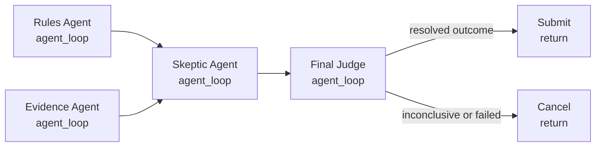

# Agent Panel Judge

Use this for higher-stakes agent-assisted markets where a single opaque judge would be too hard to audit.

The panel separates concerns:

- `rules_agent`: interprets market wording and ambiguity.
- `evidence_agent`: gathers and summarizes evidence.
- `skeptic_agent`: checks for unresolved issues and alternate interpretations.
- `judge_agent`: makes the final structured resolution decision.

