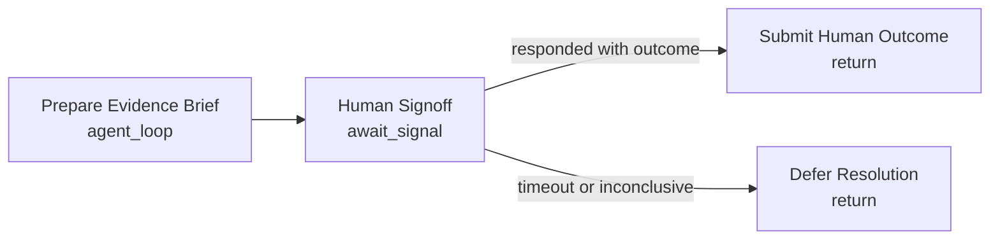

# AI Brief + Human Signoff

Use this for human-judged markets where the human should not start from a blank page. The agent prepares a compact evidence brief; the final outcome still comes from a signed `human_judgment.responded` signal.

The expected signal payload includes:

- `outcome`: zero-based outcome index.
- `reason`: human explanation.

