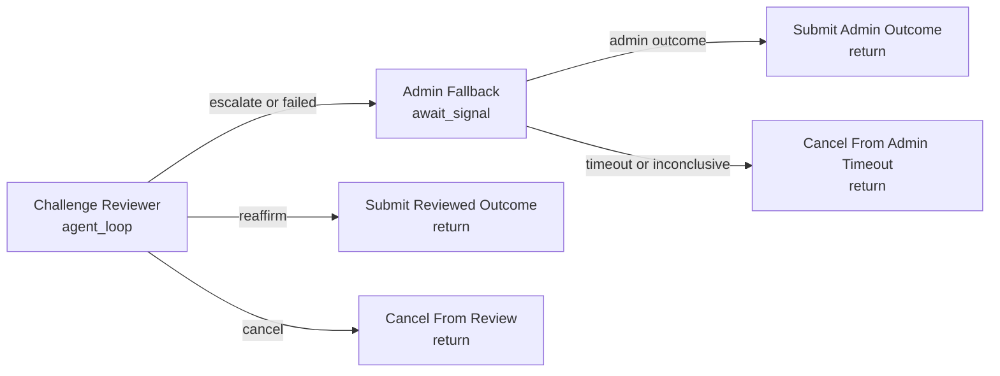

# Dispute Challenge Review

Use this as a dispute path after someone challenges a proposed resolution. The agent is not merely resolving from scratch; it evaluates whether the challenge undermines the proposed outcome.

The reviewer can:

- reaffirm the proposed outcome,
- cancel when the market is unresolvable or invalid,
- escalate to a human market admin.

