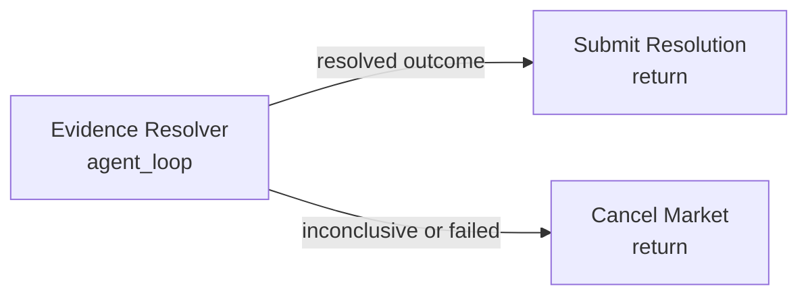

# Evidence Dossier Agent

Use this for public-web questions where the answer exists in documents, announcements, APIs, filings, or articles, but not in one clean field.

The agent can:

- inspect execution context,
- fetch public HTTP(S) sources,
- extract JSON values,
- return structured resolution output with reasoning and citations.

