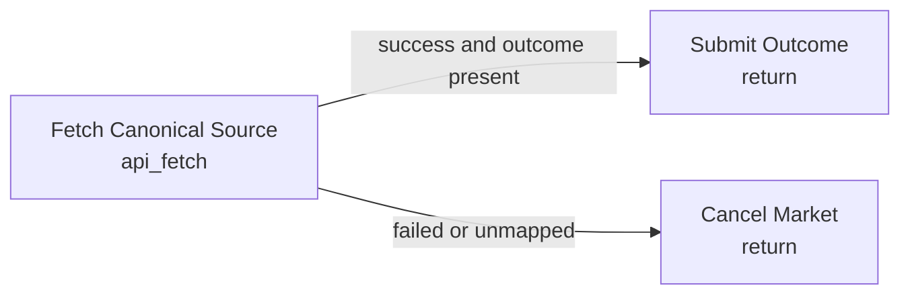

# Objective API Resolution

Use this when a market has a single canonical, machine-readable source: an official score API, exchange listing endpoint, weather station feed, chain indexer endpoint, or similar.

Required market-specific configuration:

- Replace `url` with the canonical endpoint.
- Set `json_path` to the resolved value.
- Map source values to zero-based outcome indexes in `outcome_mapping`.

