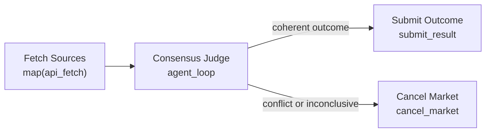

# Redundant Source Consensus

Use this when no single source should be trusted alone, but the market is still mostly objective. Examples: sports results, market prices, product release dates, or election calls where several reputable sources should agree.

Expected inputs:

- `market.sources_json`: JSON array of source descriptors.
- `market.source_url`: URL supplied to each map child in this simple placeholder version.
- `market.question`
- `market.outcomes_json`

This is a template seed. In production, the map child should receive per-item fields such as source URL and JSON path from each array item.

