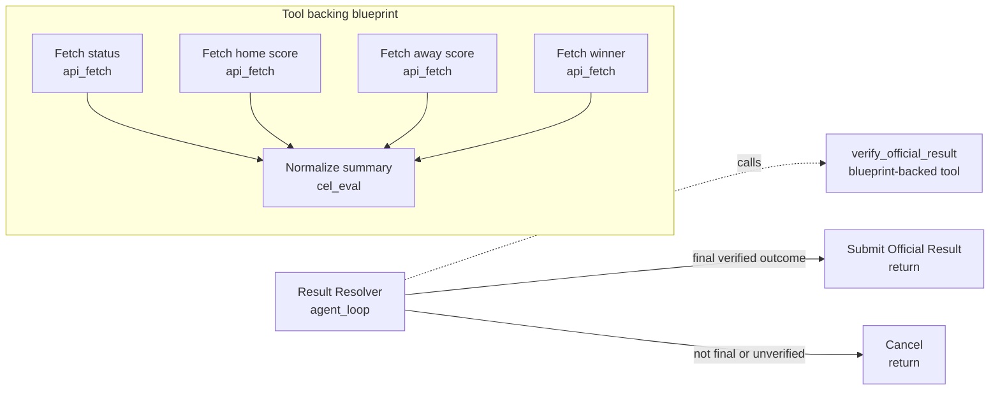

# Verify Official Result

Use this for sports or event-result markets where the resolver should consult only an approved official source. The agent sees a high-level `verify_official_result` tool instead of raw `source_fetch`.

Why use a predefined blueprint-backed tool here:

- The approved URL is fixed inside the child blueprint.
- The API schema and outcome mapping are audited once.
- The agent cannot choose unofficial sources.
- The final decision remains agent-readable and explainable.

Required market inputs:

- `market.question`
- `market.outcomes_json`
- `market.official_game_id`
- `market.home_team`
- `market.away_team`

The example assumes outcome indexes map as:

- `0`: home team wins
- `1`: away team wins
- `2`: draw, if the market has a draw outcome

