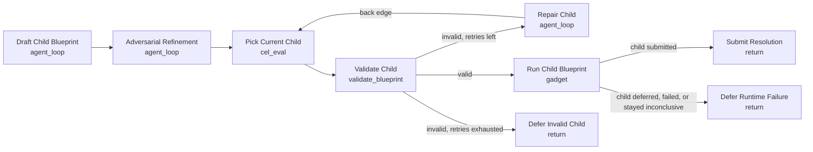

# YOLO Auto Resolution

Use this when a static resolution template is likely to be too brittle because the right evidence-gathering strategy depends on the live state of the world at resolution time.

This example keeps the risky part bounded:

- one agent drafts a child resolution blueprint,
- a second agent red-teams and strengthens it,
- the parent workflow validates and repairs the child blueprint if needed,
- a `gadget` node runs the validated child blueprint,
- the outer workflow still controls the final terminal action.

Expected inputs:

- `market.question`: market question text.
- `market.outcomes_json`: JSON array of outcome labels.
- `market.resolution_rules`: resolution criteria and edge cases.
- `market.context_json`: optional extra context, deadlines, or known facts.
- `market.sources_json`: optional curated source pack or source hints.
- `yolo.allowed_node_types_json`: JSON array of child node types the compiler may use.
- `yolo.examples_json`: JSON catalog of example blueprints or distilled patterns.
- `yolo.source_packs_json`: optional curated source-pack catalog for the child compiler.

This is “yolo mode with guardrails,” not unconstrained code execution. The child blueprint is still validated against the normal resolution rules, then bounded again by the `gadget` runtime policy before execution.

## Philosophical aside

| Method                                             | Structure location        | Entropy   | Control |
| -------------------------------------------------- | ------------------------- | --------- | ------- |
| Natural language loop (agent from prompt)          | Inside model (latent)     | Very high | Low     |
| Codegen (generate open-ended harness and run it)   | Explicit but unstructured | High      | Medium  |
| DSL (generate specific valid structure and run it) | Explicit + structured     | Lower     | High    |

