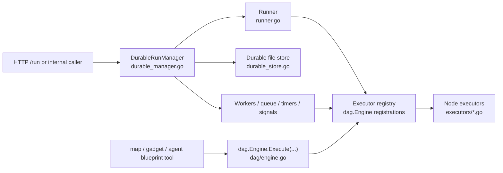
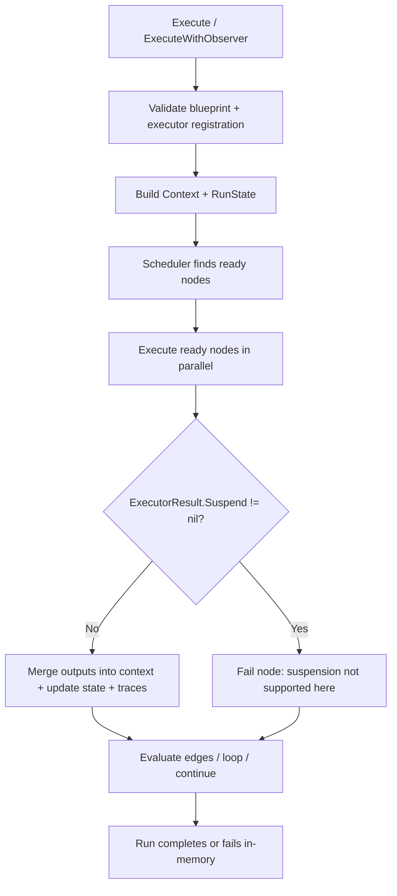
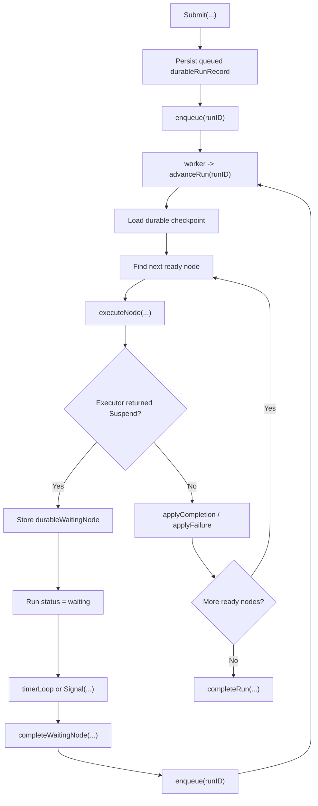
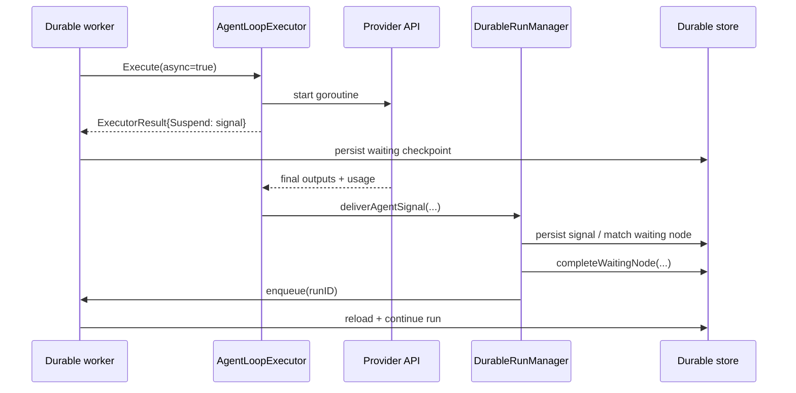

# Execution Architecture

This is the master architecture note for the execution layer in this repository.

It is written for future engineers and agents working on the codebase. The goal is
to make one thing very explicit:

- there is an in-memory DAG execution host
- there is a durable suspend/resume execution host
- they share the same blueprint model and many of the same executors
- they do **not** have the same runtime semantics

If you are changing execution behavior, read this doc before editing code.

## Why There Are Two Execution Hosts

The repository has two different ways to run a blueprint:

1. The in-memory DAG engine in [`dag/engine.go`](../dag/engine.go)
2. The durable suspend/resume manager in [`durable_manager.go`](../durable_manager.go)

They are related, but one does **not** wrap the other for top-level runs.

The in-memory engine is a synchronous runtime. It is optimized for:

- immediate execution
- parallel execution of ready nodes
- child blueprints that should finish in-process
- tests that want a small execution host

The durable manager is the service runtime. It is optimized for:

- queued top-level runs
- persisted checkpoints
- waiting on timers and external signals
- restart recovery
- durable callbacks and trace emission

The durable manager uses the executor registry from [`Runner`](../runner.go), but
it drives its own state machine instead of calling `dag.Engine.Execute(...)` for
top-level runs.

## Component Map

### Shared contract

- Blueprint and run data model: [`dag/types.go`](../dag/types.go)
- `ExecutorResult` and `Suspension`: [`dag/types.go`](../dag/types.go)
- Shared executor registration: [`runner.go`](../runner.go)

### In-memory execution host

- Entry points: [`dag.Engine.Execute`](../dag/engine.go), [`dag.Engine.ExecuteWithObserver`](../dag/engine.go)
- Main loop: [`runStateMachine`](../dag/engine.go)
- Scheduler used by both hosts: [`dag/scheduler.go`](../dag/scheduler.go)

### Durable execution host

- Manager lifecycle and queueing: [`durable_manager.go`](../durable_manager.go)
- Durable record format and file store: [`durable_store.go`](../durable_store.go)
- Run/result types: [`result.go`](../result.go)
- HTTP control plane into the manager: [`server.go`](../server.go)

### Suspension-capable executors

- `wait`: [`executors/wait.go`](../executors/wait.go)
- `await_signal`: [`executors/await_signal.go`](../executors/await_signal.go)
- `agent_loop async=true`: [`executors/agent_loop.go`](../executors/agent_loop.go), [`executors/agent_loop_types.go`](../executors/agent_loop_types.go)

### Child-blueprint safety rails

These call the in-memory engine, so they must reject suspension-capable nodes:

- `map`: [`executors/map.go`](../executors/map.go)
- `gadget`: [`executors/gadget.go`](../executors/gadget.go)
- agent blueprint tools: [`executors/agent_loop_blueprint_tools.go`](../executors/agent_loop_blueprint_tools.go)
- `SuspendableExecutor` interface + engine-side check: [`dag/engine.go`](../dag/engine.go)

## High-Level View



## Mental Model

The key abstraction is:

- executors can compute outputs immediately
- or they can return a `dag.Suspension`

But only the durable host can do anything useful with a suspension.

### Important invariant

The executor declares intent. The host owns lifecycle.

- The executor says: "park me until a timer or signal resumes me."
- The durable manager owns waiting state, persistence, matching signals, timeout firing, usage merge, and stale-record retry.
- The in-memory engine rejects suspensions as a host/runtime mismatch.

That split lives in the shared contract in [`dag/types.go`](../dag/types.go).

## In-Memory Engine

### When it is used

The in-memory engine is used for:

- direct `dag.Engine` tests
- child blueprints inside `map`
- child blueprints inside `gadget`
- agent blueprint tools such as `run_blueprint`

It is **not** the top-level service runtime.

### Flow



### Relevant code paths

- entry and validation: [`dag/engine.go`](../dag/engine.go)
- sync rejection of suspensions: [`dag/engine.go`](../dag/engine.go)
- run state model: [`dag/types.go`](../dag/types.go)
- tests for sync behavior: [`dag/engine_test.go`](../dag/engine_test.go)

### Operational semantics

- ready nodes run in parallel
- node outputs are written directly into the shared context
- loop traversals are tracked in-memory
- node history is appended when back-edges reset nodes
- if any executor returns `Suspend`, the engine fails that node with a clear error

This is why child-blueprint entry points must validate away suspension-capable
nodes before they call the in-memory engine.

## Durable Suspend/Resume Manager

### When it is used

The durable manager is the top-level runtime used by the service:

- `POST /run` creates a queued durable record
- workers advance runs
- waiting nodes park durably
- signals and timers wake them up later
- callbacks are retried through a durable outbox

### Flow



### Durable record model

The durable host persists more than the plain `dag.RunState`.

Core types:

- `durableRunRecord`: [`durable_store.go`](../durable_store.go)
- `durableCheckpoint`: [`durable_store.go`](../durable_store.go)
- `durableWaitingNode`: [`durable_store.go`](../durable_store.go)
- `signalRequest`: [`durable_store.go`](../durable_store.go)

The durable checkpoint stores:

- the latest `dag.RunState`
- shared execution context
- completed / failed / activated / skipped node sets
- per-node iteration counts
- edge traversal counters
- waiting nodes
- observed signals

`durableWaitingNode` anonymously embeds `dag.Suspension`, so the suspension
fields (`Kind`, `SignalType`, `CorrelationKey`, `Outputs`, `TimeoutOutputs`,
etc.) are reached via Go field promotion and marshal flat into the on-disk
JSON. Adding a field to `dag.Suspension` automatically appears on every
waiting entry; there is no field-by-field copy to keep in sync.

### Main code paths

- submit / cancel / get: [`durable_manager.go`](../durable_manager.go)
- worker entry: [`advanceRun`](../durable_manager.go)
- node execution: [`executeNode`](../durable_manager.go)
- signal intake: [`Signal`](../durable_manager.go)
- timer wakeups: [`timerLoop`](../durable_manager.go), [`applyDueWaiting`](../durable_manager.go)
- outgoing callbacks: [`outboxLoop`](../durable_manager.go)
- restart recovery: [`recoverRuns`](../durable_manager.go)

### Durable state machine

Typical run statuses:

- `queued`
- `running`
- `waiting`
- `completed`
- `failed`
- `cancelled`

The durable manager owns transitions between those statuses; the in-memory
engine does not.

## Suspension Semantics

The important split is not "sync executor vs async executor". It is:

- same executor contract
- different host capabilities

### Shared suspension contract

See [`dag.ExecutorResult`](../dag/types.go) and [`dag.Suspension`](../dag/types.go).

An executor may return:

- `Outputs`
- `Usage`
- optionally `Suspend`

If `Suspend` is present:

- the durable manager converts it into a persisted `durableWaitingNode`
- the in-memory engine treats it as a runtime mismatch

### Suspension kinds

Current kinds are:

- `timer`
- `signal`

Timer-based suspensions are resumed by wall-clock time.

Signal-based suspensions are resumed by:

- a matching signal
- or a timeout if `ResumeAtUnix` is set

### Signal ordering guarantees

A signal can arrive before the node that would wait on it has been persisted.
The durable manager closes that race in two places, both using the same
`findMatchingSignal` helper:

- `executeNode` checks `record.Signals` for a match *before* wrapping an
  executor's suspension into a waiting entry. If a matching signal is
  already there, the node completes directly and never enters `Waiting`.
- `applySuspension` re-runs the same check on the record being written.
  This matters on the stale-retry path: `persistWithRetry` reloads a fresh
  record that may include a signal which landed between the original load
  and the retry, and the apply-path check converts the suspension to a
  completion instead of parking on top of an already-delivered signal.

External signals and internal async-agent completions share the same path,
so this applies to every signal-based suspension kind.

### Host comparison

| Concern | In-memory `dag.Engine` | Durable manager |
| --- | --- | --- |
| Top-level service runtime | No | Yes |
| Child blueprint runtime | Yes | No |
| Accepts `Suspend` | No | Yes |
| Persists checkpoint | No | Yes |
| Survives restart | No | Yes, at checkpoint level |
| Timer wakeup | No | Yes |
| External signal resume | No | Yes |
| Durable callbacks | No | Yes |
| Queue / worker model | No | Yes |

## Suspension-Capable Executors

### `wait`

[`executors/wait.go`](../executors/wait.go)

`wait` is intentionally split:

- short waits run inline and complete synchronously
- longer waits return a timer suspension

The cut-off is `DefaultMaxInlineWaitSeconds` (20s) and is per-node overridable
via `max_inline_seconds`. Sentinel semantics:

- `< 0` forces suspension for any positive duration — tests use this to
  exercise the timer-resume code without long wall-clock waits
- `= 0` falls back to the default
- `> 0` is an explicit cap, bounded above by `MaxInlineWaitSecondsCap` (300s)
  at blueprint-validation time

This means `wait` is not automatically forbidden everywhere. The child-blueprint
check goes through [`dag.Engine.CanSuspend`](../dag/engine.go), which delegates
to the executor's own `CanSuspend(node)` method. `WaitExecutor` reports true
only for waits that would actually park — short inline waits pass.

### `await_signal`

[`executors/await_signal.go`](../executors/await_signal.go)

Always returns a signal suspension. The durable host owns:

- correlation
- required payload validation
- timeout behavior
- wakeup and completion

### `return`

[`executors/return.go`](../executors/return.go)

Emits an `EarlyReturn` payload — a JSON object with a non-empty `status`
string. Both engines treat the signal the same way: short-circuit the
run, cancel siblings/parked waits, and write the payload to
`RunState.Return` / `RunResult.Return`. The first `return` to complete
wins; later returns on parallel branches are dropped. Validation
requires every reachable non-`return` node to forward (or via a
back-edge loop) to some `return`.

### `agent_loop async=true`

[`executors/agent_loop.go`](../executors/agent_loop.go)

`agent_loop` is special because it has both synchronous and asynchronous modes:

- `async=false`: execute the tool/model loop inline and return outputs
- `async=true`: spawn work, return a signal suspension, resume later through the durable manager

This is a host-sensitive feature. Async agent loops are only valid under the
durable host.

## Async Agent Loop Path



### Why this path exists

The durable host wants to free workers while a long-lived agent call is still
in flight. That is why async agent loop work is detached from the worker and
reported back through the signal path.

### Relevant code paths

- async config: [`executors/agent_loop_types.go`](../executors/agent_loop_types.go)
- async dispatch and cancellation registry: [`executors/agent_loop.go`](../executors/agent_loop.go)
- durable signal sink wiring: [`runner.go`](../runner.go), [`durable_manager.go`](../durable_manager.go)
- async regression tests: [`durable_async_agent_test.go`](../durable_async_agent_test.go)

### Important invariants

- async token usage flows through two dedicated fields, never through the
  signal payload. `durableWaitingNode.Usage` captures whatever the
  executor knew at suspend time; `signalRequest.Usage` carries anything
  learned when the signal is delivered. `completeWaitingNode` merges
  the two via `mergeTokenUsage` before applying the completion, so node
  outputs stay free of `_async_*` transport keys and durable `run.Usage`
  stays correct
- stale or early signals must not strand a node in `waiting` — see
  "Signal ordering guarantees" above
- run cancel, back-edge reset, and shutdown must all stop in-flight async
  work — see the cancellation architecture below

### Cancellation architecture

An async agent goroutine lives outside the worker that dispatched it. The
durable host has to stop it on three events: run cancel, back-edge reset,
and manager shutdown. Two layers handle it.

**Engine layer.** `dag.CancellableExecutor` is an optional interface any
executor can satisfy:

```go
type CancellableExecutor interface {
    CancelCorrelation(correlationKey string) bool
}
```

`dag.Engine.CancelCorrelation(key)` walks every registered executor and
invokes the hook. The manager does not need to know which executor owns
the in-flight work.

**Executor layer.** `AgentLoopExecutor` keeps a correlation-key →
`context.CancelFunc` registry. Entries are added by `dispatchAsync` and
removed by the goroutine on natural completion. Public entry points:

- `CancelCorrelation(key)` — single waiter. Used by
  `evaluateOutgoingEdges` when a back-edge lands on a waiting node
- `CancelRun(runID)` — every correlation keyed to a run. Used by
  `DurableRunManager.Cancel` to close the pre-persist window where the
  waiting entry has not yet been written
- `CancelAll()` — used by `BeginShutdown`
- `InFlightCount()` — observability handle; also the test handle

**Manager lifecycle.** `SetAsyncBaseContext(ctx)` hands the manager's ctx
to the executor at construction. Each dispatched goroutine derives its
context from that base, so `manager.cancel()` during shutdown reaches
every detached request without waiting on per-invocation timeouts.

## Why Child Blueprints Need Extra Validation

`map`, `gadget`, and agent blueprint tools all call `dag.Engine.Execute(...)`.

That means they inherit the in-memory host's rule:

- no durable waiting

The repository enforces this by validating child blueprints before execution:

- `map`: [`executors/map.go`](../executors/map.go)
- `gadget`: [`executors/gadget.go`](../executors/gadget.go)
- agent blueprint tools: [`executors/agent_loop_blueprint_tools.go`](../executors/agent_loop_blueprint_tools.go)
- engine-side walker: [`dag.Engine.ValidateNoSuspensionCapableNodes`](../dag/engine.go)

The walker dispatches per-node through [`dag.Engine.CanSuspend`](../dag/engine.go),
which asks the executor itself via the [`SuspendableExecutor`](../dag/engine.go)
interface:

```go
type SuspendableExecutor interface {
    NodeExecutor
    CanSuspend(node NodeDef) bool
}
```

Capability is declared where it's implemented. No central switch on `node.Type`,
no cross-package registry to keep in sync.

This is why seemingly valid nodes may still be rejected inside child blueprints:

- `await_signal` is always rejected
- `agent_loop async=true` is rejected
- long or deferred `wait` is rejected
- short inline `wait` is allowed

## Non-Obvious Semantics To Keep In Mind

### Top-level runs do not use `dag.Engine.Execute(...)`

This is the easiest thing to forget.

Top-level service execution is driven by [`DurableRunManager`](../durable_manager.go),
not by the in-memory engine.

### The same node type may be valid in one host and invalid in another

Examples:

- `wait` can be safe inline in a child blueprint
- `wait` can also suspend durably in a top-level run
- `return` short-circuits any host (in-memory or durable)
- `agent_loop async=true` is valid durably but invalid in the in-memory host

### Suspension is a host feature, not just an executor feature

If you add a new executor that can suspend:

- add or update the durable manager behavior that consumes the suspension
- implement [`dag.SuspendableExecutor`](../dag/engine.go) so child-blueprint
  validation rejects it automatically — there is no central type switch to
  update
- add durable tests exercising the suspend → resume path

### Back-edge reset matters

The durable host can supersede a waiting node iteration via a back-edge. That
means waiting-state bookkeeping is not just "set waiting and later clear it".

Modeled in [`tla/DurableExecution.tla`](../tla/DurableExecution.tla) as the
`ExternalReset(run)` action: `waiting → queued`, `waitingKind` cleared,
`dueTimers` cleaned, `nodeDone` **not** set. The suspension was abandoned,
not resolved — `nodeDone` stays monotonic across multiple suspend/reset
cycles.

If you touch waiting nodes, also think about:

- back-edge reset
- cancellation
- shutdown
- stale-record retry

## Change Checklist

If you are adding or modifying execution behavior, use this checklist.

### If you touch a normal synchronous executor

- update the executor in [`executors/`](../executors)
- update unit tests in [`executors/executors_test.go`](../executors/executors_test.go)
- update topology or engine tests if control-flow behavior changes

### If you add a new suspension-capable executor

Do all of the above, plus:

- update the shared contract usage if needed: [`dag/types.go`](../dag/types.go)
- update durable wait/signal handling in [`durable_manager.go`](../durable_manager.go)
- implement [`dag.SuspendableExecutor`](../dag/engine.go): `CanSuspend` returns true when the node's config would actually park. Child-blueprint validation rejects suspension-capable nodes automatically.
- update `map`, `gadget`, and agent blueprint tool coverage if the child-blueprint rules change
- add durable integration tests

### If you change async `agent_loop`

Also inspect:

- [`executors/agent_loop.go`](../executors/agent_loop.go)
- [`durable_manager.go`](../durable_manager.go)
- [`durable_store.go`](../durable_store.go)
- [`durable_async_agent_test.go`](../durable_async_agent_test.go)

## Test Map

The engine is covered by a mix of unit, integration, concurrency, and fault-injection tests.

### Core in-memory engine

- [`dag/engine_test.go`](../dag/engine_test.go)

Focus:

- branches, joins, loops, token budgets, context updates, snapshots, sync rejection of suspensions

### Core executors

- [`executors/executors_test.go`](../executors/executors_test.go)
- [`executors/agent_loop_test.go`](../executors/agent_loop_test.go)
- [`executors/gadget_test.go`](../executors/gadget_test.go)
- [`executors/can_suspend_test.go`](../executors/can_suspend_test.go)

Focus:

- node semantics, async-vs-sync agent behavior, child-blueprint validation, map batching, gadget policy behavior

### Durable integration

- [`durable_manager_integration_test.go`](../durable_manager_integration_test.go)

Focus:

- restart recovery
- waiting semantics
- timer and signal resume
- callback delivery
- back-edge history
- pre-matched signals
- trace snapshots

### Durable concurrency

- [`durable_concurrency_test.go`](../durable_concurrency_test.go)

Focus:

- concurrent submit
- idempotent signals
- cancel/signal races
- enqueue races and bursts

### Durable fault injection

- [`durable_fault_injection_test.go`](../durable_fault_injection_test.go)

Focus:

- stale-record retry
- save failures
- event-log failure tolerance
- checkpoint failure recovery

### Async agent-loop integration

- [`durable_async_agent_test.go`](../durable_async_agent_test.go)

Focus:

- async completion
- timeout path
- stale / non-matching signals
- pre-persist races
- shutdown and cancellation cleanup
- back-edge reset behavior

### Fuzz / property

- [`blueprint_fuzz_test.go`](../blueprint_fuzz_test.go): random blueprints
  survive validation + engine execution without panics
- [`durable_signal_matching_fuzz_test.go`](../durable_signal_matching_fuzz_test.go):
  random waiting-entry × signal pairs exercise matcher invariants
- [`executors/fuzz_test.go`](../executors/fuzz_test.go),
  [`dag/fuzz_test.go`](../dag/fuzz_test.go): lower-level property tests

### End-to-end examples

- [`e2e_resolution_test.go`](../e2e_resolution_test.go)
- [`blueprint_topology_test.go`](../blueprint_topology_test.go)

## Formal / Spec-Oriented References

If you want a more abstract view of the durable state machine, also see:

- [`tla/DurableExecution.tla`](../tla/DurableExecution.tla)
- [`tla/DurableDagFrontier.tla`](../tla/DurableDagFrontier.tla)

These are not the implementation, but they are useful when changing the
waiting/resume lifecycle.

## Recommended Reading Order

If you are new to this area, read in this order:

1. [`runner.go`](../runner.go)
2. [`dag/types.go`](../dag/types.go)
3. [`dag/engine.go`](../dag/engine.go)
4. [`durable_manager.go`](../durable_manager.go)
5. [`durable_store.go`](../durable_store.go)
6. suspension-capable executors in [`executors/`](../executors)
7. the durable async and integration tests

## One-Sentence Summary

Think of this repository as one blueprint/executor model with two runtime hosts:

- a fast in-memory engine for synchronous child workflows
- a durable manager for queued top-level workflows that may suspend, resume, recover, and callback later
